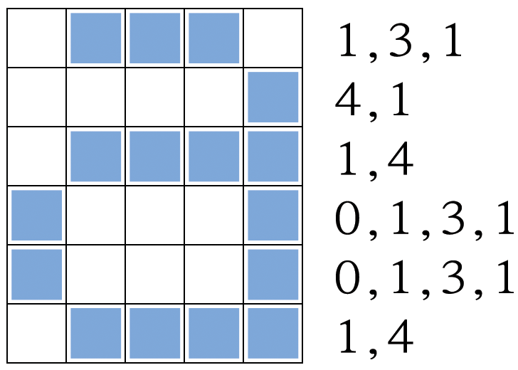
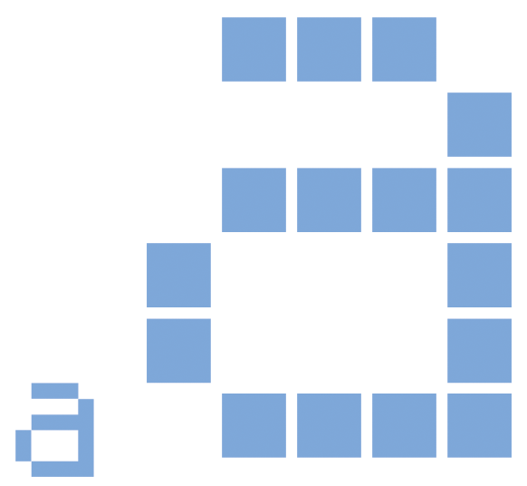
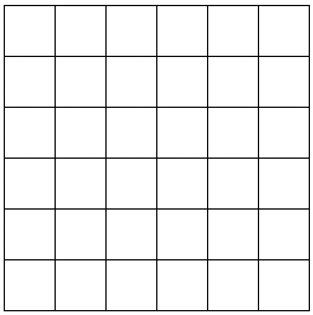
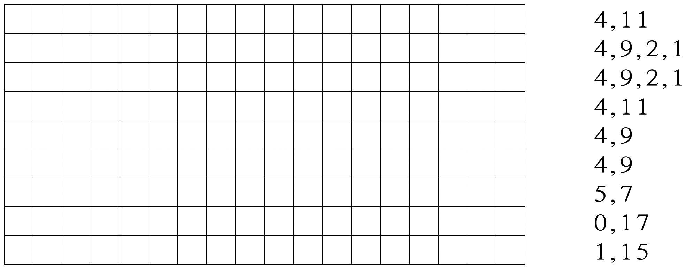
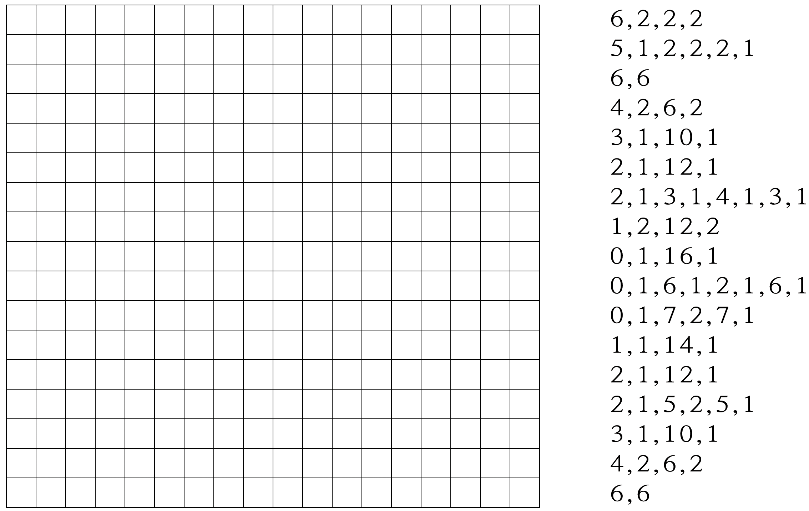
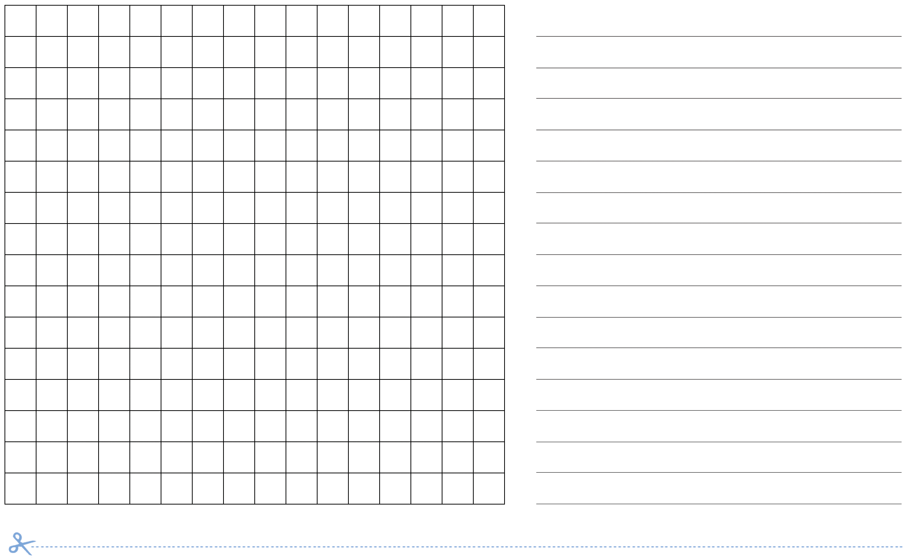
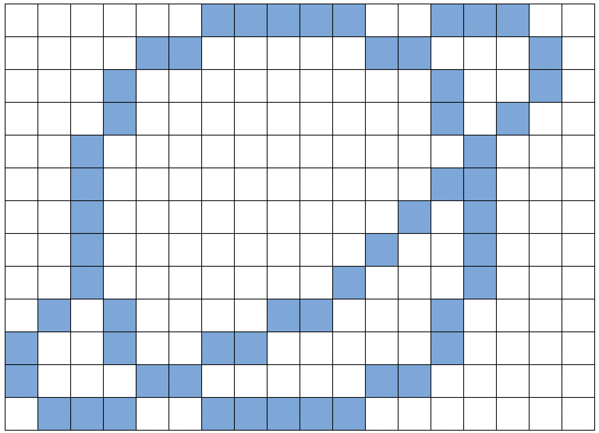
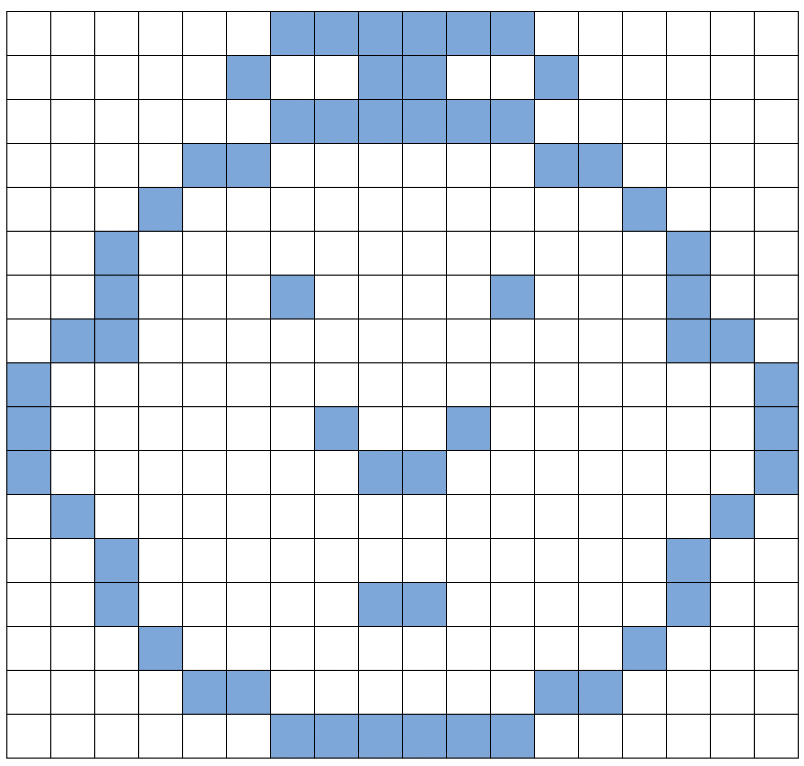

#### 개요  
컴퓨터는 습작물, 사진, 그림을 저장하는데 단지 숫자만을 사용한다. 
다음의 활동은 컴퓨터가 어떻게 이러한 작업을 하는지를 보여준다.

#### 교과학습 연계  
- 수학: 기하학 레벨 2 이상. 모양과 공간 탐색.

#### 기술  
- 계수 (Counting)
- 도식화 (Graphing): 평면을 사각형의 격자로 잘게 나누어 채색하여 그림으로 표현

#### 나이  
- 7세 이상

#### 학습 교재  
- OHP 마스터에서 복사한 OHP 시트: 숫자로 색깔 표현하기 (16쪽)
- 아이마다 필요한 것  
-- 워크시트 활동: 어린이 팩스 (17 쪽)
-- 워크시트 활동: 자신만의 사진 만들기 (18쪽)

### 숫자로 색깔 표현하기

<table width="100%" class="table table-striped">
    <tr>
        <td width="50%"><h5> 
한글 동영상
 </h5></td>
        <td width="50%"><h5> 
영문 동영상
 </h5></td>
    </tr>
    <tr>
        <td>
            

        </td>
        <td>
            

                <iframe width="350" height="260" src="https://www.youtube.com/embed/uaV2RuAJTjQ" frameborder="0" allowfullscreen>
                </iframe>
            
    
        </td>
    </tr>
</table>

##### 들어가며  
 
##### 토의 질문  
1. 팩시밀리 기계(팩스, fax)는 무슨 일을 하나요?  
2. 컴퓨터가 어떤 상황에서 그림을 저장할 필요가 있나요? (그림을 그리는 프로그램, 그래픽 게임, 멀티미디어 시스템)  
3. 컴퓨터는 숫자만 사용할 수 있는데 어떻게 그림을 저장할까요?  

(학습 활동을 위해서 아이들이 팩시밀리를 사용하여 메시지를 주고 받게 준비하는 것도 좋습니다.)

##### OHP 시트를 사용한 시연  

컴퓨터 화면(computer screen)은 픽셀(*pixels*, **pic**ture **el**ements)로 불리는 작은 점들의 격자로 나눠져 있다.  

흑백 그림에서 각 픽셀은 검은색이거나 하얀색이 된다. 

문자 "a"를 확대해서 픽셀을 살펴보자. 
컴퓨터가 그림을 저장할 때, 필요한 전부는 어느 점이 검은색이고, 어느 점이 흰색인가하는 정보다.

위 그림은 문자 "a" 그림이 어떻게 숫자로 표현되는지를 보여준다. 첫 번째 줄은 하얀 픽셀 하나, 검은 픽셀 세 개, 다시 하얀 픽셀 하나다. 그래서 첫 줄은 1,3,1로 표현된다.  

첫 번째 숫자는 항상 하얀 픽셀과 관계된다. 만약 첫 번째 픽셀이 검정색이면, 첫 번째 줄은 0으로 시작한다.

17 쪽의 연습문제에는 방금 전에 보여준 방법을 활용하여 아이들이 복호화(decode)할 그림이 있습니다.  

#### 복사 마스터: 숫자로 색깔 표현하기

  
\< 컴퓨터 화면에 보이는 “a” 문자. 문자 이미지“a”를 픽셀이 보이도록 확대한 뷰(view) \>
  
\< "동일한 이미지를 숫자 코드(code)로 표현한 것" \>

  
\< "공백 격자 그리드(grid) (교수 목적 제공)" \>  

#### 워크시트 활동: 어린이 팩시밀리

첫 번째 그림이 가장 쉽고, 마지막 그림이 가장 복잡하다. 실수하기 쉬워서 색칠할 연필과
지우개를 사용하기를 권한다.

  

  

  

  

#### 워크시트 활동: 자신만의 그림을 그리자

이제 숫자가 그림을 어떻게 표현하는지를 배웠습니다.
친구를 위해서 여러분이 직접 그림을 만들어 보세요. 
위쪽 격자 그리드에 그림을 그리고, 다 그렸으면 아래쪽 격자
그리드 옆에 숫자로 코드를 적으세요. 
점선을 따라서 자르고, 아래쪽 격자 그리드를 친구가 색칠하도록 전달해 주세요. 
(노트: 원치 않으면 전체 격자 그리드를 모두 사용하지 않아도 됩니다. 
그림이 격자 전체를 차지하지 않는다면, 아래 몇몇 줄을 공백 상태로 두세요.)

<dl>
  <dd>아래를 절취하세요</dd>
  

</dl>

  

  

#### 워크시트 활동: 자신만의 그림을 그리자 (심화문제)

**심화문제**:  채색된 이미지를 표현하려면, 색깔을 표현하는 숫자를 사용한다. (예, 0 은 검정,
1 은 빨강, 2 는 녹색 등) 두 숫자로 픽셀을 표시한다: 첫 번째 숫자는 전에 표기한 것과
같고 두 번째 숫자가 색깔을 표시한다. 
친구를 위해 색깔 그림을 만들어 보세요. 
각 숫자가 무슨 색깔을 의미하는지를 사전에 친구에게 알려주는 것을 잊지 마세요.

  

<dl>
  <dd>아래를 절취하세요</dd>
  

</dl>

  

###### 변형과 확장
1. 격자 위에 종이에 그려보세요. 최종 이미지를 격자 그리드 없이 볼 수 있게 해보세요. 이미지가 훨씬 더 선명해 집니다.  
2. 격자 그리드에 색깔을 칠하는 대신에 좀더 커다란 격자 그리드 위에 아이들이 사각형 스티커 종이를 사용하거나 물체를 놓을 수도 있어요.  

##### 토의 점
길이가 이진수로 표현되기 때문에, 픽셀 길이에 제한이 있는 것이 보통입니다.  
만약 7 까지만 숫자를 사용할 수 있는데, 어떻게 12 개 검정 픽셀을 표현할 수 있을까요? 
(좋은 방법은 일련의 7 개 검정 픽셀, 0 개 하얀색 픽셀, 그리고 일련의 5개 검정 픽셀로 표현하는 것입니다.)

#### 컴퓨터 과학 핵심 개념

팩시밀리 기계는 흑백 종이를 약 1000 × 2000 픽셀로 스캔해서 모뎀을 사용하여 다른
팩시밀리 기계에 보내는 정말 단순한 컴퓨터다. 
다른 팩시밀리 기계는 전송 받은 픽셀을 종이에 출력한다. 
종종, 팩스 이미지가 넓은 흰 공백(예, 한계(margin)) 혹은 검은 픽셀 (예, 가로줄)을 가지고 있다. 
색깔 있는 그림은 훨씬 더 많은 중복이 있다. 이런 이미지를 저장하려고
필요한 많은 저장공간을 절약하기 위해서, 프로그래머는 다양한 압축 기술을 사용한다.
여기서 사용되는 방법은 "런 길이 부호화(run-length coding)"로 불리고, 이미지를 압축하는 효과적인 방법이다. 
이미지를 압축하지 않으면, 사진을 보내는데 오랜 시간이 걸리고 추가로 더 많은 저장공간이 필요하다. 
따라서, 웹페이지에 사진을 게시하거나 팩스를 보내는 것이 가능하지 않을 수 있다. 
예를 들어, 팩스 이미지는 일반적으로 원본 크기의 7 분의 1 로 압축된다. 
압축 없이 전송하는데는 7 배 많은 시간이 걸린다.  

사진과 그림은 다양한 압축기법을 사용하여 원본의 10분의 1, 혹은 100분의 1의 크기로 압축된다. 
이렇게 압축해서 더 많은 이미지를 동일한 디스크에 저장할 수 있고,
인터넷을 통해서 사진과 그림을 보는데 짧은 시간내에 볼 수 있다는 의미가 된다.  

프로그래머는 적절한 압축 기법을 선택해서 이미지를 전송할 수 있다. 

  

  

#### 해답과 힌트

##### 어린이 팩시밀리 워크시트 정답

  
  
  

