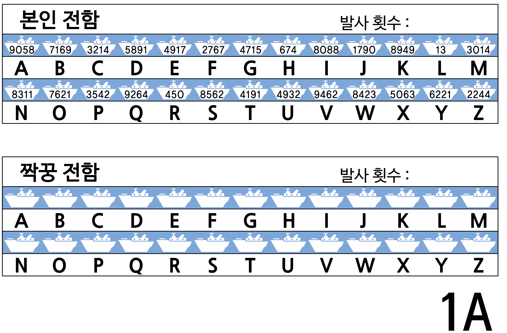
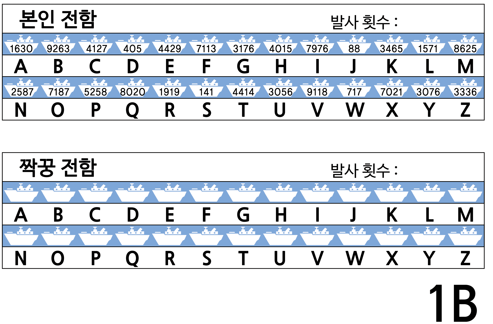
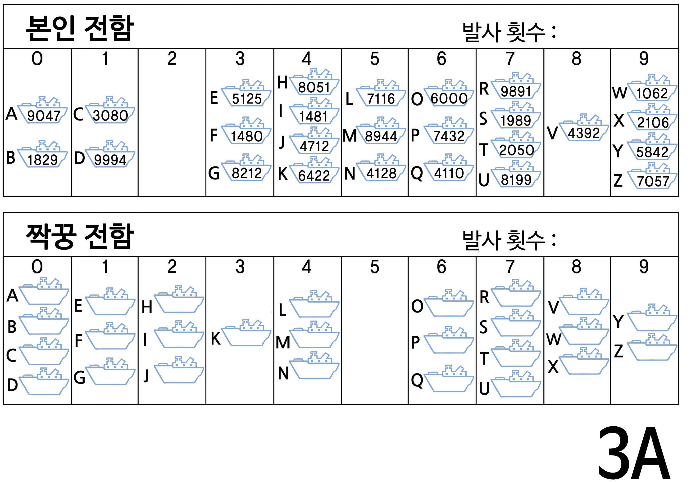

#### 개요  

컴퓨터로 대량의 데이터에서 정보를 찾아야 하는 작업이 많은데, 이런 작업을 수행하기 위해서 빠르고, 효율적인 방법이 필요합니다. 이번 활동에서는 선형 검색(linear searching), 이진 검색(binary searching), 해싱(hashing)이라는 3 종류의 다른 검색 기술을 학습합니다.

#### 교과학습 연계  
- 수학 : 숫자 레벨 3이상. 숫자 탐구: 이상, 이하, 같다.
- 기하 레벨 3 이상. 모양과 공간 탐색: 좌표

#### 기술  
- 논리적 추론 (Logical reasoning)

#### 나이  
- 9세 이상

#### 학습 교재  
- 아이들 각자가 필요한 것  
-- 전함 게임 사본  
--- 1번 게임: 1A, 1B  
--- 2번 게임: 2A, 2B  
--- 3번 게임: 3A, 3B  
- 예비 게임으로 1A', 1B', 2A', 2B', 3A', 3B' 시트가 몇 장 더 필요할 수 있다.

### 전함 (Battleships)

<table width="100%" class="table table-striped">
    <tr>
        <td width="50%"><h5> 
한글 동영상
 </h5></td>
        <td width="50%"><h5> 
영문 동영상
 </h5></td>
    </tr>
    <tr>
        <td>
        </td>
        <td>
            

                <iframe width="350" height="260" src="https://www.youtube.com/embed/iDVH3oCTc2c" frameborder="0" allowfullscreen>
                </iframe>
            
    
        </td>
    </tr>
</table>

##### 들어가는 활동

아이는 전함 게임을 통해 컴퓨터가 어떻게 탐색을 수행하는지 체험할 수 있습니다. 게임 속에서 배를 어떻게 구해야 할까를 생각하게 합시다.  

1. 대략 15명 정도 어린이를 교실 앞에 줄을 세웁니다. 각 아이에게 무작위로 두 자리 숫자가 적힌 카드를 갖게 합니다. (카드 값은 00에서 99까지 난수입니다.) 교실의 나머지 아이들이 숫자를 볼 수 없도록 잘 숨깁니다.  
2. 줄을 서지 않은 다른 아이에게 4~5개 사탕이 담긴 상자를 나눠줍니다. 이 아이의 임무는 주어진 숫자를 찾는 것입니다. 카드의 숫자를 보기 위해서 사탕을 "줄" 수도 있습니다. 모든 사탕을 사용하기 전에 정답을 찾는다면, 나머지 사탕을 가집니다.  
3. 여러 차례 반복합니다.  
4. 이제 다시 카드를 섞어 다시 나누어줍니다. 이번에는 아이들이 오름차순으로 정렬하게 합니다. 검색과정을 반복하여 숫자를 찾아냅니다.  

만약 숫자카드가 정렬되어 있다면, 중간 아이의 카드를 펴봄으로써 단 하나의 사탕으로 절반의 아이를 후보에서 제외할 수 있습니다. 이 과정을 반복함으로써, 단지 사탕 3개로 정답을 찾을 수 있습니다. 분명히 이 방법은 효율적입니다.

##### 활동

아이는 전함게임을 통해 컴퓨터가 어떻게 탐색을 하는지 간접적으로 느낄 수 있습니다. 아이들은 게임을 진행하면서, 전함을 찾아내기 위해 사용하는 전략들에 관해서 사고하게 됩니다.

#### 전함 &mdash; 선형 검색 게임

##### 아이에게 다음 명령을 전달하세요.

1. 2인 1조로 짝을 만드세요. 1명은 1A 시트(sheet)를 다른 한 명은 1B시트를 가지세요. 자신의 시트를 짝꿍에게 절대 보여주지 마세요.  

2. 모두 게임 시트 맨윗줄 전함 하나에 동그라미를 치세요. 짝꿍에게 그 번호를 알려주세요.  

3. 이제 교대로, 짝꿍의 전함이 어디에 있는지 맞춰보세요. (여러분이 배의 이름(영문 문자)을 말하고, 짝꿍이 그 이름의 전함 번호를 답합니다.)  

4. 짝꿍의 배를 맞출 때까지 얼마나 많이 대포를 쏘았나요? 대포 발사 횟수가 점수이고, 당연히 적은 횟수가 승리합니다.  

(시트 1A과 1B외에 더 게임을 하고 싶은 어린이와, 잘못해서 우연히 상대방의 시트를 본 아이를 위해서 시트 1A'과 1B'가 준비되어 있습니다. 추후 게임을 더 진행하도록 시트 2A', 2B', 3A', 3B' 예비시트도 준비되어 있습니다.)  

##### 후속 토론
1. 게임 점수가 몇 점인가요?  

2. 가능한 최소점수와 최대점수는 얼마가 될까요? (아이들이 같은 전함을 두 번 쏘지 않았다면, 최소 1과 최대 26입니다. 모든 위치를 하나씩, 하나씩, 검색하기 때문에 이 방법을 “선형 검색(linear search)”이라고 부릅니다.

#### 전함 &mdash; 이진 검색 게임

##### 지시 사항  

이번 게임의 방식은 이전 게임과 동일하지만, 전함의 숫자가 오름차순으로 정렬되어 있습니다. 게임을 시작하기 전에 아이들이게 설명해 주세요.  

1. 2인 1조로 짝을 만드세요. 1명은 2A 시트(sheet)를 다른 한 명은 2B시트를 가지세요. 자신의 시트를 짝꿍에게 보여주지 **마세요.**  

2. 모두 게임 시트 맨위줄 전함 한개에 동그라미를 치세요. 짝꿍에게 번호를 일러주세요.  

3. 이제 교대로, 짝꿍의 전함이 어디에 있는지 맞춰보세요. (여러분이 배의 이름(영문 문자)을 말하고, 짝꿍이 그 이름의 전함 번호를 답합니다.)  

4. 짝꿍의 배를 격침시킬 때까지 얼마나 많이 대포를 쏘았나요? 대포 발사 횟수가 점수이고, 당연히 적은 횟수가 승리합니다.  

##### 후속 토론  

1. 게임점수가 몇 점인가요?  

2. 점수 적은 사람은 무슨 전략을 사용했을까요?  

3. 여러분은 먼저 어느 전함을 선택했나요? (중간 전함은 선택된 전함이 왼쪽이나 오른쪽 절반에 있다고 말해줍니다.) 여러분은 다음으로 어느 전함을 선택했나요? (다시, 선택한 절반에서 한가운데 전함을 선택하는 것이 가장 좋은 최선의 전략입니다.)  

4. 만약 상기 전략을 사용한다면, 목표로하는 전함을 찾기 위해 얼마나 많은 공격이 필요할까요? (최대 5회). 문제를 두 부분으로 나누어서 찾아가기에 이 압업을 "이진 검색(binary search)"이라고 합니다.

#### 전함 &mdash; 해싱 검색 게임

##### 지시 사항  

1. 앞의 게임과 마찬가지로 각자 시트를 가지고, 짝꿍에게 선택한 전함의 숫자를 말하세요.  

2. 이 게임에서는 전함이 어느 열(0~ 9)에 있는지 찾습니다. 전함 번호의 각 자리 숫자를 단순히 더합니다. 합계의 마지막 숫자가 배가 있는 열의 번호입니다. 예를 들어, 2345 전함은 2 + 3 + 4 + 5 를 계산하여 14입니다. 합계의 마지막 숫자가 4이므로, 그 전함 4 열에 있는 것입니다. 열을 알면 해당 열중에서 목표 전함이 어느 전함인지를 찾아내면 됩니다. 모든 숫자를 밀어 넣고 쥐어짰기 때문에 이 방법을 해싱(hashing)이라고 합니다.  

3. 이 새로운 검색 전략을 사용해서 게임을 시작합시다. 다른 열을 선택하여 동일한 시트로 여러 번 게임을 진행할 수 있습니다.  

(다른 게임과 달리 예비 3A와 3B 시트를 반드시 짝으로 사용합니다. 왜냐하면, 열에 들어있는 전함 패턴이 상응해야 되기 때문입니다.)

##### 후속 토론  

1. 앞에서 진행했던 것과 동일하게 점수를 모아 토론하세요.  

2. 어떤 전함을 빠르게 찾을 수 있나요? (열에 혼자만 있는 전함) 어느 전함은 찾기가 더 어려웠나요? (많은 다른 많은 전함이 있는 열에 있는 전함)  

3. 세가지 검색 방법 중 가장 빠른 것은 무엇인가요? 이유는 무엇일까요?  

각 3 종류의 검색 방법의 장점은 무엇인가요? 두번째 검색 전략(이진 검색)은 첫번째 검색 전략(순차 검색) 보다 빠르지만, 첫번째 검색 전략은 전함을 정렬할 필요는 없습니다. 세번째 검색전략(해싱 검색)은 다른 둘 보다 빠르지만, 때때로 매우 느릴 수 있습니다. 최악의 경우, 모든 배가 같은 열에 위치한다면, 첫 번째 전략과 마찬가지 속도로 매우 늦어버립니다.

#### 확장 활동

1. 어린이에게 자신만의 3 종류의 게임을 만들게 합시다. 두번째 게임은 숫자를 오름차순으로 정렬해야 합니다. 어떻게 하면 해싱 검색 게임을 어렵게 만들 수 있는지 생각하게 합시다. (모든 전함이 1 개의 열에 위치하는 것이 가장 어렵습니다). 가장 쉽게 되는 방법도 생각하게 합시다. (각각의 열에 동일한 숫자만큼 전함을
배치합니다.)  

2. 만약 찾는 전함이 없는 경우는 어떻게 됩니까? (선형 검색방법은 없다는 것을 파악할 때까지 26 회 공격을 합니다. 이진 검색방법은 5 회 필요합니다. 해싱 검색방법은 해당 열에 얼마나 많은 전함이 배치되어 있는지에 따라 결과가 달라집니다.)  

3. 이진 검색방법을 사용하여 100대 전함이 있는 경우 얼마나 많은 공격을 해야 전함을 찾을 수 있을까요? (약 6 회), 1,000대의 전함은 어떨까요? (약 9 회) 100만대라면 (약 19 회)? (전함 수가 증가하는 속도에 비해서, 필요한 공격의 횟수는 매우 느리게 증가하는 것에 주목하십시요. 매번 전함의 수가 두 배가 될 때마다, 1회 추가 공격이 필요하니, 전함 숫자의 대수(logarithm)에 비례합니다.)

  
  
  
  
  
  

  
  
  
  
  
  

#### 컴퓨터 과학 핵심 개념

컴퓨터는 많은 정보를 저장하고 빠르게 검색해서 찾아낼 수 있어야 합니다. 가장 어려운 검색 과제 중 하나는 인터넷 검색 엔진이 1초도 되지 않는 시간 안에 수십억 웹페이지를 검색하는 것입니다. 단어, 바코드(bar code)번호, 저자 이름 같은 컴퓨터가 검색에 사용하는 데이터를 *"검색키"(search key)*라고 합니다.  

컴퓨터는 정보를 매우 빨리 처리할 수 있어서, 정보를 찾기 위해 저장소 처음부터 원하는 정보가 찾아질 때까지 순차적으로 찾는 방법을 생각할 수 있습니다. 이 방법이 순차검색게임에서 수행했던 방법입니다. 하지만 이 방법은 매우 느리고, 컴퓨터에게 조차도 부담이 됩니다. 예를 들어, 슈퍼마켓 선반에 10,000 종의 제품이 진열되어 있다고 가정합시다. 계산대에서 바코드를 스캔한다면, 제품명과 가격을 확인하기 위해 10,000 번 컴퓨터가 작업을 수행해야 합니다. 각 제품을 스캔해서 확인하는데 천분의 1초 걸린다고 하더라도, 전체 제품을 스캔하는데 10초가 소요됩니다. 가족이 먹을 식료품 값을 지불할 경우 시간이 얼마나 소요될지 상상해 보세요.  

좀더 좋은 방법은 *이진 검색(binary search)* 방법입니다. 이 방법을 사용하려면, 숫자가 정렬되어 있어야 합니다. 숫자 리스트의 중간 항목을 확인하고, 검색키가 양쪽 중 한쪽 절반에 있는지 확인합니다. 원하는 항목을 찾을 때까지 이 과정을 계속 반복합니다. 슈퍼마켓 사례로 돌아가서, 1 만개의 제품에 대해서 원하는 품목을 14 회 만에 찾을 수 있고, 0.02 초로 시간이 걸리는지 알아채기 쉽지 않습니다.  

데이터를 찾는 세 번째 전략은 '*해싱*'검색 방법입니다. 정확한 정보의 위치를 
표시하기 위해 검색키(search key)를 조작합니다. 예를 들어, 검색키가 전화번호라면, 전화번호의 모든 자리수 숫자를 더한 후에 11로 나눈 나머지 값을 취합니다. 데이터의 일부분이 처리되는 다른 데이터와 관련이 있다는 점에서, 해쉬키는 네번째 활동에서 다룬 자릿수 검증(check digits)과 유사합니다. 대체로 이 방법을 사용하여 컴퓨터는 바로 정보를 찾아낼 수 있습니다. 드물기는 하지만, 복수키가 동일하게 위치한 경우, 지시한 정보를 찾을 때까지 컴퓨터가 다시 검색을 해야하므로 시간이 좀더 걸립니다.  

데이터를 순서대로 정렬할 필요가 없거나, 심야시간의 경우처럼 늦은 속도가 문제가 되지 않다면, 컴퓨터 프로그래머는 검색기법으로 해싱 전략을 기본으로 사용합니다.

  

