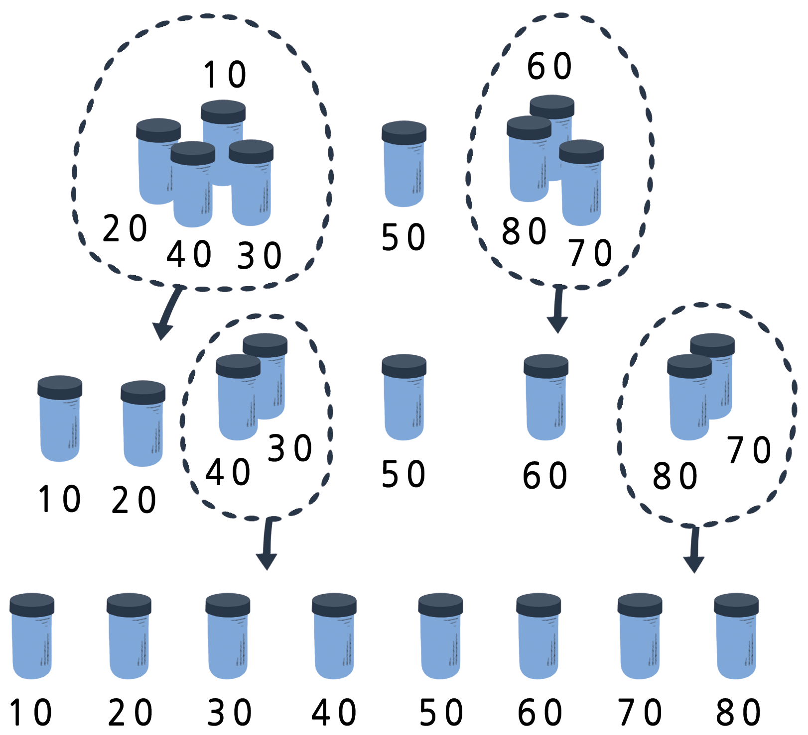

#### 개요  

컴퓨터를 이용하여 이름을 가나다 순으로, 약속이나 전자우편을 날짜 순으로, 상품을 가격 순으로 정렬할 수 있습니다. 정렬로 물건을 빠르게 찾을 수 있고, 끝 쪽에 위치한 극단값을 보기도 쉽습니다. 학교 시험 성적을 정렬한다면, 최고점과 최저점은 명확해 집니다.  

빠른 컴퓨터에서도 잘못된 정렬 알고리즘을 사용하게 된다면 매우 큰 목록을 정렬하는데 시간이 오래 걸립니다. 다행히도 정렬을 빠르게 하는 몇가지 방법이 알려져 있습니다. 이번 활동에서 정렬을 위한 다양한 방법을 익히게 됩니다. 간단한 알고리즘에 비해서 좀더 똑똑한 알고리즘이 작업을 빨리 수행하는 것도 보게 됩니다.

#### 교과학습 연계  
- 수학 : 숫자 레벨 2 이상. 실제 계량 작업을 수행.

#### 기술  
- 평형 저울 사용하기
- 순서대로 정렬하기
- 비교하기

#### 나이  
- 8세 이상

#### 학습 교재  
- 활동에 참가하는 아이들은 다음을 준비하세요.  
-- 다른 무게를 가지는 동일한 크기의 용기 8 개 한 세트(예. 모래 혹은 물로 채워진 우유통, 필름통)  
-- 평형 저울  
-- 워크시트 활동 : 무게 정렬 (70 페이지)  
-- 워크시트 활동 : 나누어서 해결하기 (71페이지)  

### 가장 가벼운 것과 가장 무거운 것

<table width="100%" class="table table-striped">
    <tr>
        <td width="50%"><h5> 
한글 동영상
 </h5></td>
        <td width="50%"><h5> 
영문 동영상
 </h5></td>
    </tr>
    <tr>
        <td>
        </td>
        <td>
            

                <iframe width="350" height="260" src="https://www.youtube.com/embed/cVMKXKoGu_Y" frameborder="0" allowfullscreen>
                </iframe>
            
    
        </td>
    </tr>
</table>

##### 토론

컴퓨터를 이용하여 종종 물건을 정렬하는데 사용합니다. 정렬이 중요한 장소나 사례에 대해서 자유로이 생각을 말씀해보세요. 만약 물건이 정렬되지 않는다면 무슨 일이 생길까요?  

컴퓨터는 통상 한번에 두개 값을 비교합니다. 아이들은 이러한 제약사항을 이용하여 컴퓨터가 어떻게 동작하는지 아이디어를 얻게 됩니다.  

##### 활동

1. 아이들을 그룹으로 나눕니다.  

2. 각 그룹은 66 페이지의 활동 워크시트와 평형 저울과 추가 필요합니다.  

3. 아이들이 활동을 수행한 후에 결과를 토론합니다.  

#### 워크시트 활동 &mdash; 무게 정렬하기

**목적**: 알 수 없는 무게를 가진 대상을 순서대로 정렬하는 가장 좋은 방법 찾기  

**필요한 준비물**: 물 혹은 모래, 서로 구별할 수 없는 용기 8개, 평형 저울 한 세트

**따라 하기**:

1. 각 용기를 다른 양의 모래 혹은 물로 채우고 밀봉하세요.  

2. 각 용기를 뒤죽박죽 섞어서, 더 이상 각 용기의 무게를 짐작할 수 없게 합니다.  

3. 가장 가벼운 것을 찾으세요. 가장 가벼운 것을 찾는 손쉬운 방법은 무엇일까요?  

**주의**: 각 용기의 무게가 얼마인지 측정하기 위해서만 평형저울을 사용합니다. 단, 한번에 용기 두개 무게만 비교할 수 있습니다.

4. 무작위로 용기 3개를 골라서 평형저울만 사용해서 가장 가벼운 것부터 가장 무거운 것까지 순서대로 정렬하세요. 어떻게 수행했는지 자세하게 작성하고 말해보세요. 비교횟수를 적게 했던 것은 어떤 방식이었나요? 왜 그런지 이유를 설명해 보세요.  

5. 모든 용기를 가장 가벼운 것부터 가장 무거운 것까지 정렬해 보세요.  

정렬 작업을 마쳤다고 생각한다면, 용기를 둘씩 짝지어 무게를 재서 용기가 순서대로 정렬되었는지를 확인해보세요.  

##### 선택 정렬 (Selection Sort)
*선택 정렬(selection sort)*은 컴퓨터가 사용하는 정렬 방법 중의 하나입니다. 어떻게 작동하는지 살펴봅시다. 정렬대상이 위치한 곳과 정렬결과를 놓을 곳으로 나누고, 가장 가벼운 것을 골라 정렬결과 장소를 옮겨놓습니다. 그 다음으로 가벼운 것을 골라 옮겨 놓는 것을 반복하여 더 이상 정렬대상에 아무것도 없을 때까지 반복합니다.

  

얼마나 많은 비교를 수행했는지 횟수를 세어보세요.  

> **심화문제**: 8개 물체를 정렬하기 위해서 얼마나 많은 비교를 
> 수행했는지 수학적으로 보이세요. 9개의 물체 정렬은? 20개의 물체 정렬은?

#### 워크시트 활동 &mdash; 나누어서 해결하기

##### 퀵정렬(Quicksort)

퀵정렬은 특히 정렬 목록이 많을 때, 선택 정렬보다 훨씬 빠르다. 사실 지금까지 알려진 가장 좋은 정렬방법 중의 하나다. 다음은 어떻게 퀵정렬이 작동하는지 보여준다.  

무작위로 정렬 대상 중에서 하나를 골라 평형저울 한쪽에 놓습니다.  

남아있는 정렬대상을 앞에서 선택한 물체와 비교를 합니다. 가벼운 것은 왼쪽에, 무작위로 고른 정렬기준은 가운데, 무거운 것은 오른쪽에 위치하게 됩니다. (우연히, 한쪽에 더 많은 물체가 몰려있을 수도 있습니다.)  

왼쪽편과 오른편 그룹에서도 상기와 동일한 과정을 반복합니다. 무작위로 선택한 1 개 물체를 반드시 중간에 두는 것을 잊지 마십시오.  

1개 이상의 물체를 가진 그룹이 없을 때까지 이 절차를 반복하여 1개 이상의 물체를 담고 있는 그룹은 하나도 남지 않게 됩니다. 모든 그룹에 1개 물체가 있을 때, 모든 물체는 가벼운 것부터 가장 무거운 것 순으로 정렬이 완료됩니다.

  

이 과정에서 얼마나 많은 비교를 했습니까?  

우연히 가장 가벼운 것, 혹은 가장 무거운 것을 선택하지 않는다면, 퀵정렬이 선택정렬보다 더 효과적이라는 것을 알게 됩니다. 운이 좋아서 중간을 고른다면, 선택정렬 28회 비교 횟수와 비교하여 단지 14 회 비교횟수만 필요합니다. 퀵정렬은 운이 나빠도 선택정렬만큼, 대부분의 경우 선택 정렬보다 훨씬 빠르다!

> **심화문제**: 우연히 퀵정렬이 가장 가벼운 물체를 선택했다면, 
> 얼마나 많은 비교 작업을 수행해야 할까요?

###### 변형과 확장

다양하게 많은 정렬 방법들이 개발되었습니다. 
다음 방법들을 적용하여 무게를 정렬해봅시다.  

*삽입정렬(Insertion sort)* 아래의 그림처럼, 정렬되지 않은 그룹에서 객체를 하나씩 빼서 정렬된 그룹에 올바른 위치에 삽입합니다. 매번 삽입할 때마다 정렬되지 않은 그룹의 객체는 줄어들게 되고, 정렬된 객체 목록는 늘어나게 되고, 궁극적으로 전체 리스트 객체가 정렬됩니다. 트럼프 카드 게임을 하는 카드 플레이어가 카드를 정렬하는데 동일한 방법을 사용하는데, 정렬할 카드를 이미 정렬된 카드를 가진 손으로 한 장씩 뽑아서 옮깁니다.

  

*버블정렬(Bubble sort)*은 순서가 뒤바뀐 객체 위치를 바꾸는 과정을 반복적으로 수행합니다. 순서를 바꾸는 작업을 반복적으로 수행해서 더 이상 바꿀 객체가 없을 때 멈추게 되고, 모든 객체는 정렬이 됩니다. 이 방법이 그다지 효율적이지 않지만, 다른 방법보다 이해하기 쉽다고 생각하는 사람도 많습니다.

  

*병합정렬(Mergesort)*은 ‘나누어 해결하기(divide and conquer)’ 전략에 기초한 정렬방법입니다. 첫번째로, 정렬대상이 짝수라면 동일 크기를 가지는 그룹 두개로, 홀수라면 거의 동일한 크기의 그룹 두개로 나눕니다. 각각 두 그룹을 정렬하고, 정렬된 두 그룹을 병합합니다. 정렬된 두개 그룹을 병합하는 것은 쉽습니다. 정렬된 두 그룹에서 가장 작은 것을 뽑아 비교하여 병합하는 과정을 반복합니다. 아래 그림에서 40그램과 60그램이 각 그룹에서 가장 작은 것이고, 이를 비교하여 40g이 더 작기 때문에 추가됩니다. 이제 더 작게 되었는데 어떻게 정렬할까요? 간단합니다. 다시 병합정렬을 이용합니다. 이를 반복하면 결국 모든 정렬 대상은 각 그룹별로 1개만 남게 되고 병합정렬을 이용한 모든 정렬은 끝나게 됩니다.

  

#### 컴퓨터 과학 핵심 개념

정보가 순서로 나열되어 있으면 훨씬 찾기가 쉬워집니다. 전화번호부, 사전, 책 색인은 모두 가나다 순서로 되어 있지만, 만약 정렬이 되어 있지 않은 상황을 생각한다면, 우리는 매우 불편한 생활을 살게 될 것입니다. 지출경비 같은 숫자 목록이 잘 정렬되어 있다면, 가장 큰 숫자가 목록 상단에 위치하기 때문에 쉽게 찾을 수 있을 것입니다. 중복된 것은 함께 있기 때문에 찾기 쉬울 것입니다.  

컴퓨터는 무언가를 정렬하는데 시간이 많이 소요되기 때문에 컴퓨터 과학자들은 빠르고 효율적인 정렬방법을 찾으려고 했습니다. 삽입정렬, 선택정렬, 버블정렬 같은 느린 정렬방법은 특별한 상호아에 유용할 수도 있지만, 퀵정렬 같은 빠른 정렬방법을 자주 사용합니다.  

퀵정렬은 재귀(recursion)라는 개념을 사용합니다. 재귀방법은 정렬 대상 목록을 작은 그룹으로 나누고 각 그룹에 동일한 방법을 반복해서 수행하는 것입니다. 이 특별한 접근법을 *'나누어 해결하기(divide and conquer)'*라고 합니다. 정렬 작업을 수행하기 위해서, 목록을 나누어 해결할 수 있을 만큼 적당히 작게 만드는 과정을 반복합니다. 퀵정렬은 각 그룹 객체가 1개만 남을 때까지 목록을 분할합니다. 한 품목을 정렬하는 것은 어느 방법을 사용해도 차이가 없습니다! 퀵정렬은 복잡할 수 있지만, 다른 방법보다 실무에서 훨씬 빠른 정렬방법입니다.

  

#### 해답과 힌트

1. 가장 가벼운 것을 찾는 최선의 방법은 지금까지 나온 가장 가벼운 것을 높고 각 객체를 차례차례 살펴보는 것이다. 즉, 두 객체를 비교하여 더 가벼운 것을 보관한다. 이것을 다시 다른 것과 비교하여 더 가벼운 것을 보관한다. 모든 객체에 대해서 이 방법을 반복한다.  

2. 평행저울에 무게를 달아 비교하자. 세번 비교를 통해서 가능한데, 만약 아이들이 추이관계(transitive relation)를 이해한다면 때때로 두 번으로도 충분하다. (만약 A가 B보다 가볍고, B가 C보다 가볍다면, A는 C보다 가볍다.)  

**심화문제**  

선택정렬에서 비교횟수를 쉽게 계산하는 방법을 소개합니다.  

객체 2개 중에서 작은 것을 찾는 것은 1회, 객체 3개는 2회, 객체 4개는 3회…  

객체 8개를 정렬하기 위해서 가장 가벼운 것을 찾기 위해서 7번 비교를 하고, 두 번째 작은 것을 찾기 위해서는 6번, 그 다음 작은 것은 5회, … 그래서,  

~~~
7 + 6 + 5 + 4 + 3 + 2 + 1 = 28 비교횟수
~~~
{:class="in"}

n 개 개체는 1 + 2 + 3 + 4 +… + n – 1 번의 정렬횟수가 필요합니다.  

정렬횟수 총합을 구하기 위해서 그룹을 지으면 쉽습니다.  

예를 들어, 1 + 2 + 3 + … + 20 합계를 구하기 위해, 아래와 같이 그룹으로 묶게 되면,  

~~~
(1 + 20) + (2 + 19) + (3 + 18) + (4 + 17) + (5 + 16) +  
(6 + 15) + (7 + 14) + (8 + 13) + (9 + 12) + (10 + 11)  
= 21 × 10  
= 210  
~~~
{:class="in"}

따라서, 선택정렬의 비교횟수 총합: 1 + 2 + 3 + 4 … + n–1 = n(n–1)/2.

