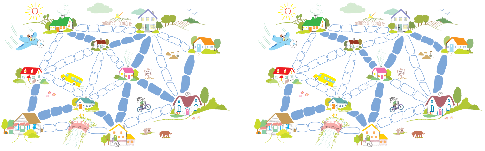
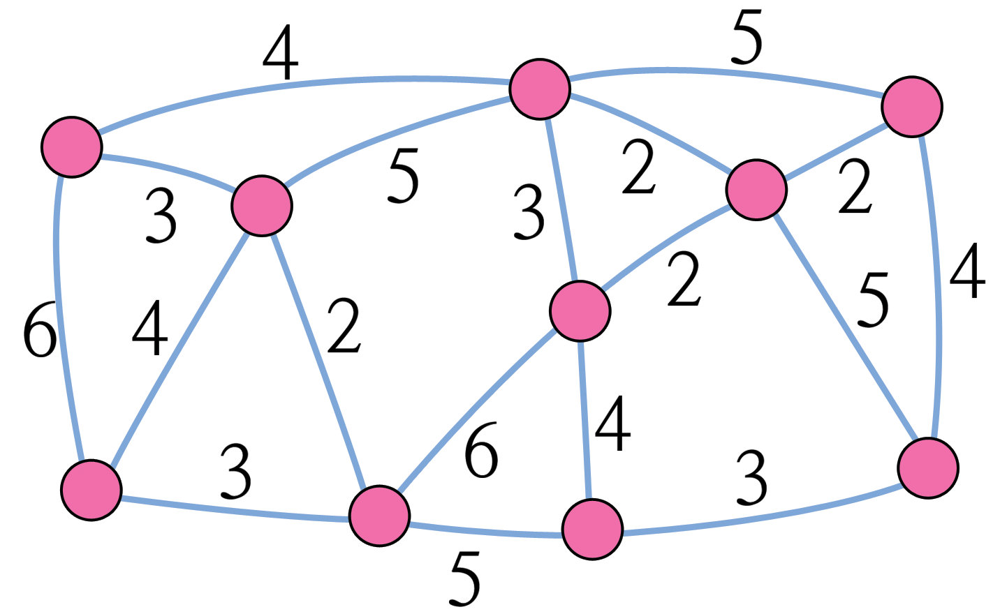

#### 개요  

우리 사회는 전화, 에너지 공급, 컴퓨터, 도로 등 다양한 네트워크로 연결되어 있습니다. 각각의 네트워크에는 도로, 케이블, 혹은 무선 네트워크를 어떻게 배치하는지에 대한 설계 결정이 녹여져 있습니다. 효율적으로 네트워크에서 객체를 연결하는 방법을 파악할 필요가 있습니다.

#### 교과학습 연계  
- 수학 : 기하 레벨 2/3 이상. 모양과 공간 탐색: 지도에서 최단 거리 찾기

#### 기술  
- 문제 해결하기

#### 나이  
- 9세 이상

#### 학습 교재  
- 아이들이 필요한 것  
-- 워크시트 활동: 진흙도시 문제 (page 83)  
-- 판지를 작은 사각형으로 자른 것 (대략 아이당 40개)

### 진흙 도시

##### 들어가며

이번 활동을 통해서 현실 세계 문제에서 어떻게 최적의 해결책을 찾는데 컴퓨터를 이용하는지 보여줍니다. 예를 들어, 모든 가정에 전기를 공급하는 전선과 도시 가스를 공급하는 가스관을 어떻게 연결하는지가 좋은 사례입니다. '진흙도시'(Muddy City) 문제를 설명하는 78 페이지 워크시트를 사용하세요.

##### 후속 토론

아이들이 발견한 해결책을 공유하세요. 아이들은 무슨 전략을 사용했나요?  

최적 해결책을 찾는 좋은 방법중의 하나는 빈 지도에서 시작해서, 빈 지도에서 점차적으로 도로 포장을 늘려가면서 모든 집들이 연결되게 하는 것입니다. 도로 포장은 최단 거리에서 길어지는 순서대로 진행하지만, 이미 연결된 집은 추가로 연결을 하지 않습니다. 만약 동일 길이 포장도로가 추가되어 순서를 바꾼다면 다른 해결책을 찾은 것입니다. 두 가지 가능한 해결책을 다음에 있습니다.

  

다른 전략은 모든 도로가 포장된 상태에서 시작해서, 필요하지 않은 도로포장를 제거하는 것입니다. 하지만, 더 많은 노력이 듭니다.  

현실세계에서 네트워크는 어디에 사용되고 있을까요?  

컴퓨터 과학자는 이런 네트워크 표현을 "그래프(graph)"라고 합니다. 실제 네트워크를 그래프로 표현하여 마을과 마을을 연결하는 도로 설계 또는 지역과 지역을 연결하는 항공로 설계와 같은 문제를 풀어 최상의 네트워크를 설계하는데 활용합니다.  

두 점을 연결하는 최단 거리를 찾는 방법, 모든 점을 연결하는 가장 짧은 경로를 찾는 방법처럼 그래프를 적용한 많은 다양한 알고리즘이 있습니다.

#### 워크시트 활동: 진흙 도시 문제

옛날에 전혀 도로가 없는 도시 하나가 있었습니다. 비가 온 뒤에 땅이 진흙탕이 되어 도시를 돌아다니는 것은 무척이나 어려웠습니다. 자동차는 진흙 웅덩이에 빠지고, 사람들 신발은 곧 더러워졌습니다. 진흙 도시 시장은 도로의 일부를 포장하기로 결정하였지만, 예산을 많이 사용하고 싶지는 않았습니다. 주민들이 수영장 건립을 원했기 때문입니다. 그래서 시장은 다음의 두 가지 조건을 제시했습니다.  

1. 도로가 충분히 포장되어 누구나 자신의 집에서 다른 사람의 집으로 포장된 도로만을 이용하여 이동할 수 있어야 한다.  
2. 포장비용은 최대한 저렴하여야 한다.  

다음에 마을 지도가 있습니다. 포장하기 위해서 돌을 사용하는데, 돌의 개수가 집과 집 사이를 포장하는데 드는 비용을 나타냅니다. 모든 집을 포장된 길로 연결하고 비용이 최대한 저렴하게 경로를 구축해 보세요. (참고로, 다리는 포장에서 제외합니다.)  

이 문제를 풀기 위해서 무슨 전략을 사용했나요?

  

###### 변형과 확장  

다음은 진흙 도시와 도로를 그래프로 표현한 사례입니다.

  

집은 원으로 표시하고, 진흙 도로는 선으로 표시하고, 도로 길이는 선 옆의 숫자로 표시합니다.  

종종 컴퓨터 과학자와 수학자는 최적화 문제를 표현하기 위해 이런 종류의 그림을 사용하고, *그래프(graph)*라고 합니다. 처음에는 혼동스러울 수 있습니다. 왜냐하면 통계에서 사용하는 "그래프"는 숫자 데이터를 표현하기 위한 막대그래프 같은 차트를 의미하기 때문입니다. 하지만 컴퓨터 과학자가 사용하는 그래프는 이것과 연관되어 있지 않습니다. 길이를 반듯이 도로 길이에 비례하여 작성할 필요는 없습니다.  

자신만의 "진흙도시"와 같은 비포장 도로를 최소 비용으로 포장하는 문제를 만들어 봅시다. 지도를 그래프 형태로 보여주는 것도 좋습니다. 그리고 친구에게 그 문제를 풀게 해 봅시다.  

가장 좋은 해결책으로 얼마나 많은 도로가 포장되어거나 혹은 연결되어야 하는지 기술할 수 있는 규칙을 찾았습니까? 도시에 얼마나 많은 집이 있는지가 그 규칙과 관련이 있나요?

#### 컴퓨터 과학 핵심 개념

여러분이 전기, 가스, 수도 등을 새로운 거주지에 공급하는 것을 설계한다고 가정해봅시다. 모든 집의 전선 혹은 파이프는 공공기업(한전, KT, 가스공사 등)에 연결되어야 합니다. 각각의 집은 어떻게든 네트워크에 연결되어야 하지만 어떤 경로를 취할 것인가는 연결만 된다면 그다지 문제가 되지 않습니다.  

네트워크 경로 길이가 최소가 되도록 설계하는 작업을 "*최소생성나무*"(minimal spanning tree)문제라고 합니다.  

"최소생성나무"는 가스나 전력 네트워크에만 유용한 것이 아닙니다. 컴퓨터 네트워크, 전화 네트워크, 송유관, 항공운항 경로 문제를 해결하는데 도움이 됩니다. 하지만, 여행의 최적 경로를 결정할 때는 비용이 얼마나 드는지, 여행이 얼마나 편안할지도 함께 고려해야 합니다. 단지 비용이 저렴하다는 이유로, 처음으로 여행가는 나라에 비행기를 장시간 타면서 시간을 낭비하려는 사람은 많지 않을 것입니다. 비행경로나 화물 운송경로를 최소화하는데 사용되는 진흙도시 알고리즘은 여행경로와 같은 네트워크 최적화하는 데에는 그다지 도움이 되지 않습니다.  

최소생성나무 알고리즘은 그래프에 관한 다른 문제(예를 들어 "외판원 문제 [Travel Salesman Problem, TSP]")를 해결할 때 단계중의 하나로서 유용합니다. 외판원 문제는 네트워크의 모든 점을 방문하는 최소 경로를 찾는 것입니다.  

최소생성나무 문제를 해결하는 효과적인 알고리즘과 방법이 있습니다. 최적의 해결책을 주는 간단한 방법은 아무 연결도 없는 상태에서 시작해서, 앞에서 연결되지 않은 점들을 비용이나 크기가 커지는 순서대로 연결을 하는 것입니다. 1956년에 J.B. Kruskal이 발표하여 Kruskal 알고리즘이라고 합니다.  

"외판원 문제" 등, 그래프에 관한 많은 문제에 관해서는 지금도 컴퓨터 과학자가 가장 최선의 가능한 해결책을 찾아내는데 충분히 빠른 방법을 찾으려고 노력을 경주하고 있습니다.

  

#### 해답과 힌트

##### 변형과 확장 (79 페이지)  

도시에 집이 n개 있다면 얼마나 많은 도로 연결이 필요할까요? 
최적의 해결책은 정확하게 n-1 개 연결을 갖는 것으로 밝혀졌다. 
n-1개 연결은 n 개 집을 연결하는데 충분하다. 
왜냐하면, 연결을 하나 더 추가하는 것은 집 사이에 불필요한 대체가능한 연결을 하나 더 만들기 때문이다.

