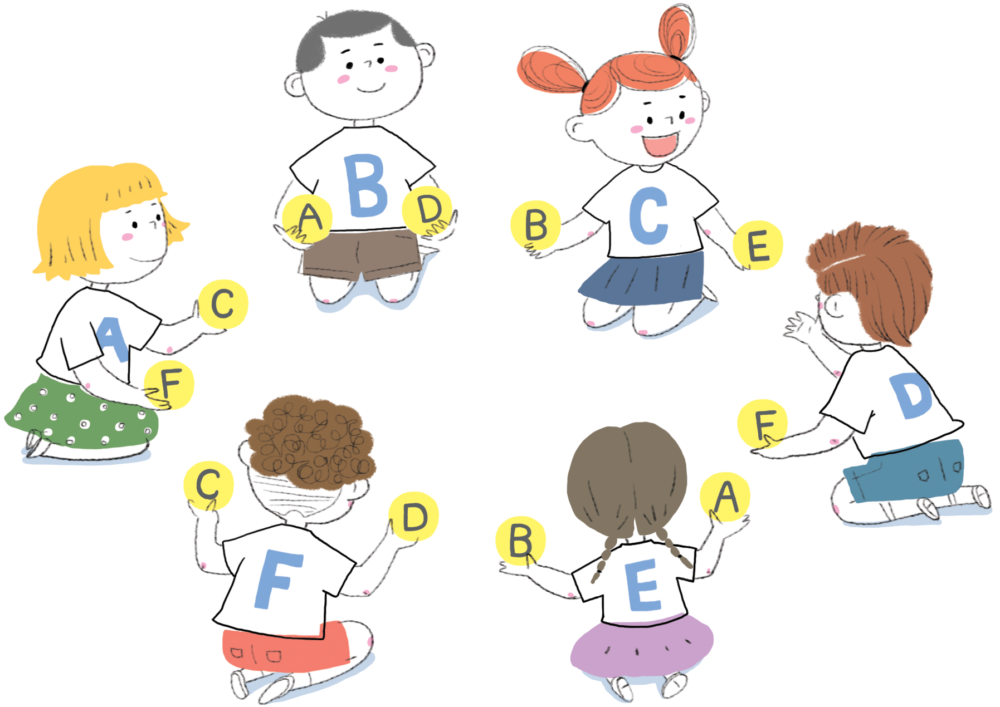

  

#### 개요  

자동차가 다니는 도로나 메시지가 지나가는 인터넷 같이 하나의 자원을 많은 사람이 공유하여 사용할 때, 교착상태(deadlock) 발생 가능성이 있다. 교착상태가 발생하는 것을 피하는 방법은 협력하는 것이다.

#### 교과학습 연계  
- 수학 : 논리와 추론 개발하기

#### 기술  
- 협력하여 문제 해결하기
- 논리적 추론하기

#### 나이  
- 9세 이상

#### 학습 교재  
- 각 아이들에게 필요한 것  
-- 오렌지 두 개 혹은 테니스 공  
-- 부착이 가능한 이름표 또는 이름 스티커  

### 오렌지 게임

<table width="100%" class="table table-striped">
    <tr>
        <td width="50%"><h5> 
한글 동영상
 </h5></td>
        <td width="50%"><h5> 
영문 동영상
 </h5></td>
    </tr>
    <tr>
        <td>
            

                <iframe width="350" height="260" src="https://www.youtube.com/embed/DDffwl2z9YA" frameborder="0" allowfullscreen>
                </iframe>
            

        </td>
        <td>
            

                <iframe width="350" height="260" src="https://www.youtube.com/embed/WforXEBMm5k" frameborder="0" allowfullscreen>
                </iframe>
            
    
        </td>
    </tr>
</table>

##### 들어가며
이 게임은 협력하여 문제를 해결하는 게임이다. 참가자 전원이 자신의 이름이 이니셜로 새겨진 오렌지를 모두 갖는 것이 게임의 목표입니다.  

1. 5명 혹은 그 이상의 아이들이 한 그룹으로 원을 그려 앉습니다.  

2. 아이들 모두 자신의 이니셜을 이름표나 이름 스티커에 적습니다. 한 명을 제외한 모든 아이들은 오렌지 두 개에 자신의 이니셜을 붙입니다. 제외된 한 명은 하나만 오렌지에 붙여 한 손에 들고 있고, 나머지 손은 빈손입니다.  

3. 원에 둘러 앉은 아이들에게 무작위로 오렌지를 나눠줍니다. 오렌지 하나만을 가진 한 명을 제외하고 모든 아이들은 오렌지 두개를 가집니다. (단, 어떤 아이도 자신의 이니셜이 적힌 오렌지를 갖으면 안됩니다.)  

4. 자신의 이니셜을 가진 오렌지를 모든 아이들이 가질 때까지 아이들은 오렌지를 전달합니다. 이때 두 가지 규칙을 지켜야 합니다.  

a) 한번에 상대에게 전달할 수 있는 오렌지는 1 개뿐입니다.  

b) 바로 옆 사람의 손이 빈 경우에만 오렌지를 전달할 수 있습니다. (즉, 옆 사람에게 오렌지를 전달할 수 있는 아이는 한번에 1 명뿐입니다.)  

만약 아이들이 욕심을 부려 자신의 이니셜이 적힌 오렌지를 손에 넣어 다른 아이에게 오렌지를 전달하지 못하게 한다면 그룹 전체가 게임의 목표를 달성할 수 없다는 것을 재빨리 알아챌 것입니다. 이 때, 누군가 자신의 이니셜이 적힌 오렌지를 차지하여 게임에서 "승리"하는 것이 목적이 아니라, 모두가 자신의 이니셜이 적힌 오렌지를 가질 때 게임 퍼즐을 풀 수 있다는 것을 강조할 필요가 있다.  

##### 후속 토론

아이는 문제를 해결하기 위해 어떤 전략을 사용했습니까?  

실생활에서는 어떤 장소에서 교착상태(deadlock)를 경험했습니까? (교통 체증, 야구경기에서 베이스를 도는 주루선수, 많은 사람이 동시에 출구를 통과하려는 모습 등)

##### 확장 활동

좀더 작거나 큰 원을 그려 활동을 확대해 보자  

- 아이들이 새로운 규칙을 제시하도록 하자  
- 어떤 말을 하지 말고 활동을 진행해 보자  
- 아이들이 한 줄로 앉던가, 두명 이상의 아이가 옆에 앉도록 형태를 바꿔서 진행해 보자. 몇가지 확장활동 제안 예시가 다음에 있다.  

   

#### 컴퓨터 과학 핵심 개념

도로, 전화, 컴퓨터 시스템 같이 많은 네트워크에서 라우팅(Routing)과 교착상태(Deadlock)는 흔한 문제다. 엔지니어들은 이런 문제를 어떻게 해결할 것인가, 문제를 풀기 쉬운 네트워크를 어떻게 설계할지에 대해서 많은 연구를 한다.  

라우팅, 정체, 교착상태는 많은 네트워크에서 좌절감을 안겨줄 정도의 문제를 제시한다. 출퇴근 혼잡 시간대에 교통상황을 상상해 보세요. 뉴욕이나 서울 도로에 너무나 많은 자동차가 흘러나와 혼잡한 상황이 되어서 어떤 자동차도 움직일 수 없는 교착상태가 되는 경우가 종종 있습니다. 때때로, 은행 같은 금융업무용 컴퓨터가 다운이 될 때는 통신 네트워크에 교착상태가 원인입니다. 라우팅이 쉽고, 효율적이며, 정체가 최소화되는 네트워크를 설계하는 것이 많은 엔지니어들이 직면한 어려운 문제입니다.  

여러 사람이 동일 시간대에 동일한 데이터를 요구하는 것은 자주 있는 일입니다. 고객의 예금 잔고와 같은 데이터를 갱신할 때, 그 찰라의 시간에 "잠금(lock)"을 걸어 타인에게 보이지 않도록 하는 것이 중요합니다. 만약 잠겨 있지 않으면, 다른 누군가가 데이터를 동시에 갱신해서, 잘못된 예금 잔고가 기록되어 버릴 수도 있기 때문입니다. 그러나, 이러한 잠금 설정이 다른 항목의 잠금 설정에 의해 충돌나거나 간섭이 발생하는 상황이 되면 교착 상태가 발생할지 모릅니다.  

컴퓨터 설계에 있어 가장 획기적인 업적 중 하나는 병렬 컴퓨팅(parallel computing)의 등장입니다. PC같은 개인용 컴퓨터 수백, 수천 개의 중앙처리장치(processor)를 네트워크로 결합하여 하나의 강력한 컴퓨터를 만든 것입니다. 이러한 병렬 컴퓨터를 작동시키기 위해서 오렌지 게임과 같은 많은 문제가 네트워크에서 항상 (훨씬 빠르게) 재현되고 있는 것입니다.

  
