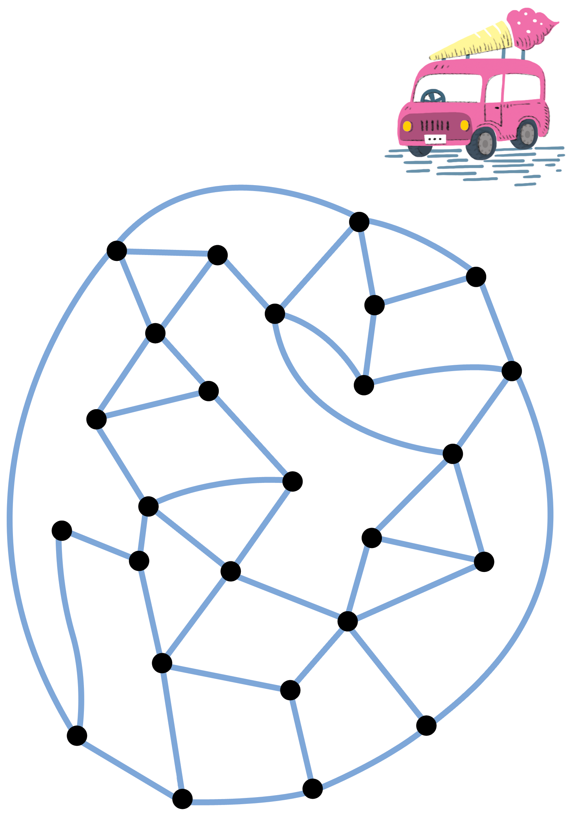
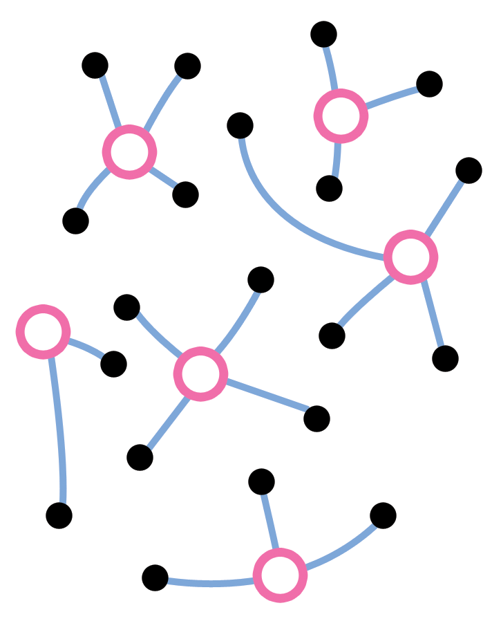
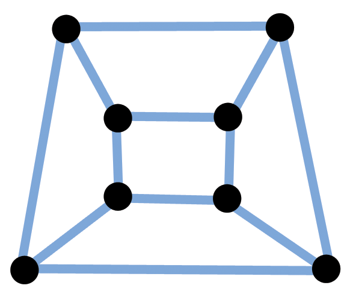

> #### 개요  {.getready}
> 
> 실생활의 많은 상황은 네트워크 형태나 혹은 활동 13에서 채색에 사용된 종류의 그래프로 추상화될 수 있다. 네크워크는 실무적으로 유용한 알고리즘 개발을 위한 많은 기회를 제공한다. 
> 이번 활동에서 교차점 즉 ``노드(node)``를 몇개 표시해서 다른 모든 노드가 각 노드들과 한 구간 떨어지게 만드는 것이다. 질문은 얼마나 적은 노드를 표시해서 네트워크 완성 작업을 완료하는냐가 > 된다. 이것은 놀랍게도 매우 어려운 문제가 된다.  
> 
> #### 교과학습 연계  
> - 수학 레벨 2: 위치와 방향
> 
> #### 기술  
> - 지도.  
> - 관계.  
> - 퍼즐 풀기.  
> - 반복적 목표 탐색.  
> 
> #### 나이  
> - 7세 이상  
> 
> #### 학습 교재  
> - 각 그룹의 아이마다 필요한 것:    
>     - *아이스크림 승합차* 검은색 라인 마스터 사본.  
>     - 두가지 다른 색깔 포커칩 혹은 (보드게임에 사용되는) 패 몇개.  
> - 선생님이 필요한 것:  
>     - 화이트보드/칠판에 *아이스크림 승합차 해답* 검은색 라인 마스터 빔프로젝터 이미지 혹은 해답을 그려서 보여줄 수 있는 화이트보드/칠판.  

> ### 언플러그드 활동 동영상  {.prereq}
> | 한글 동영상 | 영어 동영상 |
> :---------------------------------: | :-------------:|
> | 애타게 찾고 있습니다. | 애타게 찾고 있습니다. |

> ### 지배 집합(Dominating Sets) {.objectives}
> 
>    
> 
> #### 들어가며
> 
> 아이스크림 승합차 워크쉬트에는 관광 마을 지도가 있다. 선(line)은 거리가 되고, 점(dot)은 거리 모퉁이가 된다. 마을은 매우 더운 지방에 위치해 있고, 여름에 아이스크림 화물차는 거리 모퉁이에 > 자리잡고 아이스크림을 관광객에게 판다. 승합차를 잘 배치해서 누구나 걷고 있는 거리 끝까지 걸어서, 그리고 나서 기껐해야 한 블록 더 걸어 아이스크림을 살 수 있어야 한다. (거리를 걷고 있는 > 상황보다 교차로에 서 있는 사람을 상상하는게 더 쉬울 수 있다; 최대로 한 블록만 걸어서 아이스크림을 살 수 있어야 한다.) 질문은 얼마나 많은 승합차가 필요하고, 어느 교차로에 승합차를 > 배치해야 할까?  
> 
> #### 토론  
> 
> 1. 학생을 작은 그룹으로 나누고, 각 그룹에게 관광 마을 지도, 패 몇개를 나눠주고, 스토리를 설명한다.  
> 2. 학생들에게 아이스크림 승합차를 표시려고 어떻게 교차로에 패를 놓는지 보여주고 나서 한 블록 떨어진 교차로에 다른 색깔의 패를 놓는다. 여기 교차로에 있는 사람(혹은 이 거리를 따라 걷고  있는 사람)은 아이스크림 승합차에서 사먹을 수 있다.  
> 3. 학생들에게 승합차를 다른 자리로 옮겨 진행하게 한다. 학생들이 모든 조건을 만족하는 조합을 찾아나게 되면, 승합차는 대여하는데 비싸기 때문에 가능하면 적게 사용하여 조건시키도록 상기시킨다> . 모든 교차로에 충분한 승합차를 배치시키면 조건을 만족할 수 있다는 것은 명확하다 &mdash; 흥미로운 질문은 얼마나 적은 승합차로 조건을 만족시킬 수 있느냐는 것이다.  
> 4. 관광 마을에 최소 승합차 숫자는 6대다. 정답이 여기 있다. 하지만 정답을 찾는 것은 매우 어렵다! 잠시 후에, 학습에 있는 학생에게 승합차 6대가 충분하니 도전과제로 적절한 장소에 승합차를  배치시키도록 하자. 여전히 매우 어려운 문제다: 많은 그룹에서 결과적으로 포기한다. 승합자 8대 혹은 9대를 사용한 경우도 정답을 찾기가 어렵다.  
> 5. 관광 마을 지도는 *아이스크림 승합차 해답* 워크쉬트 하단에 있는 6개 조각 지도를 사용해서 만들어졌다. 명백하게도 각각의 조각지도는 단지 하나의 승합차만 필요하고 해답을 위장하기 위해서 > 거리를 되도록 많이 연결시켰다. 주요점은 해답 교차로(열린 점)들 사이는 어떤 연결도 하지 않고 나머지 점(닫힌 점)들 사이만 연결하는 것이다. 학급 학생들에게 이 기법을 칠판이나 빔프로젝터를 > 사용하여 보여주세요.  
> 6. 동일한 전략을 사용하여 자신만의 어려운 지도를 학생들에게 작성하게 하세요. 스스로 만들어서 친구들이나 부모님에게 자랑하고 싶을지도 모른다&mdash; 만든 사람은 풀 수 있으나 다른 사람들은 풀 수 없는 퍼즐을 만든 것을 알기 때문이다. `일방향 함수(one-way function)`이라고 불리는 예제다: 퍼즐을 만들기는 쉽지만, 풀기는 매우 어렵다. 특히, 처음에 만든 사람이 본인이 아니라면 그렇다. 일방향 함수는 암호학에서 매우 중요한 역할을 수행한다. (활동 17, 18 참조)  
> 
>    

> #### 워크시트 활동: 아이스크림 승합차   {.callout}
> 
> 교차로에 아이스크림 승합차를 적절히 배치해서, 다른 모든 교차로가 아이스크림 승합차가 있는 교차로와 연결되는 방법을 찾아보세요.  
> 
>    
> 

> #### 워크시트 활동: 아이스크림 승합차 해법 {.callout}
> 
> 
>    
> 
> 퍼즐이 만들어진 방법을 학생에게 보여주세요.

> #### 변형과 확장 {.callout}
> 
> 도시 계획을 세울 때, 직면하는 상황이 대략 이런 종류의 문제가 된다: 우편함 설치, 우물 파기, 소방소 위치 등. 실생활에서 풀기 쉬운 기교가 있지도 않다. 만약 정말로 이런 종류의 문제를 해결해야 한다면, 어떻게 하시겠습니까?  
> 
> 매우 간단한 방식이 있다: 아이스크림 승합차를 배치할 수 있는 모든 가능한 방법을 고려해서 어느 것이 가장 최선인지를 모두 점검한다. 관광 마을에는 26개 교차로가 있고 따라서 승합차를 배치할 > 26개 방식이 있다. 26개 모든 가능성을 점검하기는 쉽다. 어떤 것도 원하는 조건을 만족하지 못한다는 것은 명확하다. 승합차가 두대 있을 때, 첫번째 승합차를 놓을 장소는 26개가 된다. 두번째  승합차를 배치할 장소는 25개가 된다. (명확하게 동일한 교차로에 승합차를 모두 배치하지는 않는다.) 26 × 25 = 650 점검할 경우의 수가 있다. 모든 경우의 수를 점검하는 것은 매우 지루한  작업이지만, 다시 각각을 점검하는 것은 쉽다. 사실 경우의 수 중에 절반(325)만 점검하기만 하면 된다. 왜냐하면 어느 승합차가 되던 상관없기 때문이다. 교차로 A에서 1번 승합차를 점검하고, 교차로 B에서 2번 승합차를 점검한다면, 교차로 B에서 1번 승합차, 교차로 A에서 2번 승합차를 점검할 필요는 없다. 세번째 승합차(2,600 경우의 수), 네번째 승합차(14,950 경우의 수) ... 계속 점검해 나가면 된다. 명백하게도, 26대 승합차는 충분한데 단지 26개 교차로만 있기 때문이고, 동일한 장소에 1대 이상의 승합차를 배치할 이유는 없다. 경우의 수를 평가하는 또다른 방식은 26개 교차로에 승합차 수의 모든 구성조합수를 고려하는 것이다. 각 교차로에는 두가지 경우의 수(승합차 유무)가 있기 때문에 구성조합의 총 개수는 2^26, 67,108,864가 된다.  
> 
> 이런 방식의 문제해결 방법을 ``무작위 알고리즘(brute-force algorith)``이라고 하며 해를 얻기까지 오랜 시간이 걸린다. 작업량에 관계없이, 컴퓨터가 너무 빨라서 어떤 문제도 빨리 풀 수 있다는 > 것은 널리 알려진 오해다. 사실은 그렇지 않다. 무작위 알고리즘이 얼마나 시간이 걸릴지는 특정 구성조합이 해답인지 아닌지를 점검하는데 얼마나 빨리 수행하느냐에 달려있다. 가장 가까운  승합차까지의 거리를 찾기 위해서, 모든 교차로를 시험하는 것이 점검사항에 포함된다. 모든 구성조합을 시험하는데 1초 걸린다고 가정하자. 관광 마을 경우에 2^26 모든 경우의 수를 시험하는데 얼마나 오랜 시간이 걸릴까? (정답: 2^26은 약 6,700만; 하루는 86,400초, 2^26초는 약 777일, 즉 약 2년) 1초 대신에 각 구성조합을 점검하는데 천분의 일초가 걸린다고 가정하자. 그리고, 컴퓨터가  36 교차점을 해결하는데 2년이 소요된다고 가정하자. 왜냐하면 2^36은 1,000 * 2^26 이기 때문이다. 컴퓨터가 설사 백만배 더 빨라져서 백만 구성조합을 1초에 점검한다면, 46개 교차점을 점검하는데는 2년이 소요된다. 이정도 마을은 그다지 큰 마을이 아니다! (얼마나 많은 교차로가 여러분이 살고 있는 마을과 도시에는 있나요?)  
> 
> 무작위 알고리즘은 매우 느려서, 문제를 풀 수 있는 다른 방법이 있을까? 활동 9, 진흙도시에서 성공적인 사용한 욕심쟁이 접근법(greedy approach)을 시도해 볼 수 있다. 아이스크림으로 어떻게  욕심을 부릴 수 있는지 생각해볼 필요가 있다&mdash; 욕심쟁이 접근법을 어떻게 아이스크림 승합차 문제에 적용할 수 있을까? 하는 의미다. 욕심쟁이 접근법을 적용하는 방식은 다음과 같다. 가장  많은 도로와 연결되는 교차로에 첫번째 승합차를 배치한다. 두번째 승합차는 그 다음으로 많은 도로와 연결된ㅁㄴㄴㄴㄴㄴㄴ
> 결되는 교차로에 배치한다. 이와 같은 방식을 계속 반복한다. 하지만, 이 방식이 반듯이 최소 아이스크림 승합차 숫자를 보장하지는 않는다. 사실, 관광 마을에서 가장 많은 도로와 연결된 교차로(5개 > 도로와 연결)는 승합차를 배치하기에 적절한 장소가 아니다. (수업 시간에 점검해 보라.)  
> 
>   좀더 쉬운 문제를 살펴보자. 최소 구성조합을 찾는 대신에, 구성조합이 주어지고, 구성조합이 최소인지 아닌지 알아본다고 가정하자. 몇몇 경우에 이런 일은 쉽다. 예를 들어, 다음 다이어그램은  해답이 매우 직관적으로 다가오는 좀더 단순한 지도다. 만약 도로를 큐브의 가장자리로 상상한다면, 아이스크림 승합차 두대를 대각선으로 정반대 위치에 배치하면 충분하다는 것은 명확하다. 좀더  살펴보면, 승합차 두대 미만으로 문제를 풀 수 없다는 것도 확인할 수 있다. 불가능하지는 않지만, 승합차 6대 미만으로 관광 마을에 아이스크림을 팔 수 있다는 것을 증빙하기는 훨씬더 어렵다.  일반적인 지도에서, 특정 아이스트림 승합차 구성조합이 최소 구성조합인지 증명하기는 매우 어렵다.  
> 
>    

> #### 컴퓨터 과학 핵심 개념 {.challenge}
> 
> 아이스크림 문제에 관한 흥미로운 것 중에 하나는 무작위 알고리즘(brute-force algorithm)보다 훨씬 더 빠르게 최소 배치 위치를 찾는 알고리즘의 존재여부를 *어느 누구도 알고 있지 못하다.*  교차점의 숫자가 증가함에 따라 무작위 알고리즘을 사용한 시간이 기하급수적으로 증가한다&mdash; *지수시간 알고리즘(exponential time algorithm)*이라고 한다. *다항시간 알고리즘(polynomial- time algorithm)* 실행시간은 교차로 숫자의 제곱, 세제곱, 17제곱 등으로 증가한다. 다항시간 알고리즘은 충분히 큰 지도에 대해 항상 더 빨리 수행될 것이다. 심지어 17제곱승 알고리즘 조차도  그렇다. 왜냐하면, 인자가 충분히 크게되면, 지수시간으로 증가하는 함수가 임의의 다항시간으로 증가하는 것을 압도하기 때문이다. (예를 들어, n이 117보다 크게 되면, n^17은 2^n보다 작다.) 최소  장소 조합을 찾아내는 다항시간 알고리즘이 존재할까요? 일부 사람이 매우 열심히 찾으려고 노력을 했지만, 아무도 알지 못한다. 특정 장소 조합이 최소인지 확인하는 좀더 쉬운 작업도 마찬가지다.  좀더 작은 장소 조합의 모든 경우의 수를 시도하는 무작위 알고리즘은 교차로 수에 기하급수적이고, 다항시간 알고리즘이 발견되지도, 존재하지 않는다고 증명되지도 않았다.  
> 
> 지도 채색하기(활동 13)을 상기시키나요? 네 그렇습니다. 아이스크림 승합차 질문은 공식적으로 ``최소 지배 집합(minimal dominating set)``으로 불리는 매우 큰 문제중의 하나다. 이 문제에 대해서 다항시간 알고리즘이 존재하는지 알려져 있지 않다. 관련된 분야는 논리, 조각그림 맞추기부터, 지도 채색 문제, 작업 계획 세우는 문제, 지도상에 최적 경로 찾는 문제까지 다양한다. 놀랍게도, 이 모든 문제는 서로 대등한 것으로 보여진다. 만약 다항시간 알고리즘을 이 다양한 문제중 하나에서 찾는다면, 이것을 다른 분야에 다항시간 알고리즘으로 전환할 수 있다&mdash; 이들 모두는 함께 일어서고, 함께 몰락한다고 말할 수도 있다.  
> 
> 이러한 문제를 *NP-완전(NP-complete)*하다고 한다. NP는 ``non-deterministic polynomial(비결정성 다항식)``의 약자다. 이것이 의미하는 바는 만약 임의로 매우 큰 솔류션(비결정적인 부분)을  한번에 시도할 수 있는 컴퓨터가 있다면, 유의미한 시간 내에 문제가 풀수 있다는 뜻이 된다. 아마도 매우 비현실적인 가정이라고 생각할지도 모른다. 사실 그렇다. 이런 유형의 컴퓨터를 만드는 것은  가능하지 않다. 왜냐하면 컴퓨터가 매우 커야되기 때문이다. 하지만, 이런 컴퓨터 개념은 원칙적으로 매우 중요하다. 왜냐하면, 비결정적인 컴퓨터 도움없이는 NP-완전 문제를 적절한 시간내에 풀 수 없기 때문이다.  
> 
> 더욱이, 이 문제 그룹은 *완전(complete)*하다고 불리는데 이유는 설사 매우 다른 문제처럼 보이지만, 한 문제에 대해서 효율적인 방법을 찾게 된다면, 그 방법을 다른 *어떤* 문제에도 접목할 수 있다> . 예를 들어, 지도 채색은 아이스크림 승합차 배치 문제와 매우 다르다. 이러한 연유로 인해서, 어떤 효율적인 솔류션도 존재하지 않는다고 매우 강하게 의심을 가져왔다. 하지만, 필연적으로  기하급수적으로 시간이 걸리는 문제를 증명하는 것이 오늘날 이론 컴퓨터 과학분야&mdash;아마도 모든 수학분야&mdash;에서 가장 중요한 미결과제다.  
> 
> ##### 추가 읽기
> Harel의 책 *Algorithmics*에서 NP-완전 문제 몇개를 소개하고, 다항시간 알고리즘이 존재하는지에 대해 논의한다. Dewdney의 *Turing Omnibus*도 NP-완전을 다룬다. 이 주제에 대한 표준 컴퓨터 과학 교과서는 Garey & Johnson의 *Computers and Intractability*로 NP-완전을 증명하는 기법과 더불어 수백가지의 NP-완전 문제를 소개하고 있다. 하지만, 매우 깊이 다루고 있어서, 정말 컴퓨터 과학 전문가에게만 적합하다.
> 

