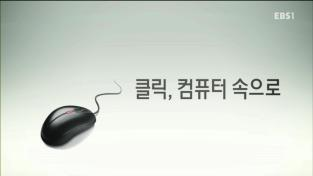
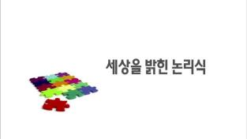
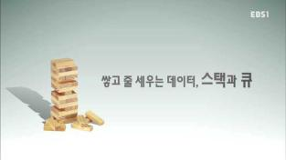

> ## 컴퓨터 과학 번역 목적 {.prereq}
>
> **정보 불평등(Digital Divide)**을 **기회(Opportunites)**로 만드는 계기가 대한민국 누구에게나 **공평(Fair)**하게 주여져야 합니다.
> - [xwMOOC](http://www.xwmooc.net) -
 

정보 불평등(Digital Divide)을 기회로 전환하는 컴퓨터 소프트웨어 교육 [xwMOOC](http://www.xwmooc.net/) 프로젝트 중의 일환이며, 일부 G-창업 프로젝트 [경기중소기업종합지원센터](http://www.egbiz.or.kr/) 지원을 받았습니다. 

컴퓨터 과학 언플러그드는 [Computer Science Unplugged](http://csunplugged.org/) 책에 기반하고 있으며, 한국적인 상황을 최대한 반영하여 내용 및 삽화를 일부 수정하였습니다. 또한, 컴퓨터 과학 언플러그드 공유 및 협업을 위해 [GitHub](https://github.com/statkclee/website-csunplugged)에 그동안 작업결과가 정리되어 있다. 특히, [소프트웨어 카펜트리(Software Carpentry)](http://software-carpentry.org/) 템플릿을 사용한 것이 도움이 많이 되었다.

한국어 번역 및 삽화 작업에 도움을 주신 분들은 다음과 같다.

> #### 한국어 프로젝트 참여자 및 원저작자 정보
> 
>한국어 번역: 이광춘  
>한국어 삽화: 문춘경  
>저자: Tim Bell, Ian H. Witten, Mike Fellows  
>실험수업:  Robyn Adams and Jane McKenzie  
>삽화: Matt Powell  

> ### 한글 컴퓨터 과학 언플러그드 버젼 {.callout}
> 
> - 2016년 1월 : EBS 링크, 소프트웨어 세상 제작 동영상
>     -  [링크, 소프트웨어 세상](http://bit.ly/1Vx98an)
> - 2015년 05월: 컴퓨터 과학 언플러그드 3.1 버젼 한글 번역 완료 HTML/PDF/E-PUB 무료 전자책 배포
>     - 인터넷에 대한 신규 활동 추가, 로고 변경
>     - 버젼 3.0에서 Part I, Part II로 양분되었던 교재(MS 워드)가 하나로 합쳐짐.
>     - 교육과정이 뉴질랜드 중심에서 글로벌 교육체계에 맞춰 변경.
>     - 한국어 언플러그드 교재를 PDF, E-PUB, HTML로 다양화하여 제공. 
> - 2015년 03월: 컴퓨터 과학 언플러그드 3.0 버젼 MS 워드 기반에서 마크다운 공개 소프트웨어 플랫폼 변환(GitHub)
> - 2015년 02월: 컴퓨터 과학 언플러그드 3.0 버젼 삽화 한국화 작업
> - 2015년 01월: 컴퓨터 과학 언플러그드 3.0 버젼 Part IV,V,VI 번역 (MS 워드)
> - 2014년 08월: 컴퓨터 과학 언플러그드 3.0 버젼 Part I,II,III 번역 (MS 워드) 

> ### 소프트웨어 기초 동영상  {.prereq}
> 
> | 컴퓨터 원리 | 논리식 | 자료구조 |
> |:----------------------:|:----------------------:|:----------------------:|
> | | | |

### 목차 

-  [한국어 번역](00-korean-translation.html)
-  [들어가며](00-intro.html)
-  [감사의 글](00-acknowledgements.html)
1.  [제1부 정보를 나타내는 원재료&mdash;데이터](01-part/intro.html)  
    - [점의 개수를 세다&mdash;이진수](01-part/01-binary-numbers.html)  
    - [숫자로 색깔 표현하기&mdash;이미지 표현](01-part/02-image-representation.html)  
    - [다시 말할 수 있어요!&mdash;텍스트 압축](01-part/03-text-compression.html)  
    - [카드 뒤집기 마술&mdash;오류 탐지 및 수정](01-part/04-checksum.html)  
    - [질문 20개&mdash;정보 이론](01-part/05-info-theory.html)  
2.  [제2부 컴퓨터를 동작시키기&mdash;알고리즘](02-part/intro.html)    
    - [전함 (battleship)&mdash;검색 알고리즘](02-part/06-searching-algorithm.html)    
    - [가장 가벼운 것과 가장 무것운 것&mdash;정렬 알고리즘](02-part/07-sorting-algorithm.html)  
    - [시간내 일을 마치기&mdash;정렬 네트워크(Sorting Network)](02-part/08-sorting-networks.html)  
    - [진흙도시 프로젝트&mdash;최소생성나무(Minimal Spanning Trees)](02-part/09-minimal-spanning-tree.html)  
    - [오렌지 게임&mdash;네트워크 라우팅(Routing)과 교착상태(Deadlock)](02-part/10-routing-deadlock.html)  
    - [돌명판(Tablets of Stone) &mdash; 네트워크 통신 프로토콜](02-part/11-internet.html)
3.  [제3부 컴퓨터에 무엇을 수행할지 지시하기&mdash;절차의 표현](03-part/intro.html)  
    - [보물 찾기&mdash;유한상태 오토마타](03-part/12-fsm.html)  
    - [진군 명령&mdash;프로그래밍 언어(Programming Languages)](03-part/13-language.html)  
4. [제4부 정말 어려운 문제 &mdash; 난해성(Intractability)](04-part/intro.html)      
    -  [가난한 지도 제작자 &mdash; 그래프 색칠하기](04-part/14-graph-coloring.html)  
    -  [관광 마을 &mdash; 지배 집합 (Dominating Sets)](04-part/15-dominating-sets.html)  
    -  [얼음길 &mdash; 스타이너 트리(Steiner trees)](04-part/16-steiner-trees.html)  
5. [제5부 비밀 공유와 범죄와 전쟁 &mdash;암호화(Cryptography)](05-part/intro.html)  
    - [비밀공유 &mdash; 정보 은닉 프로토콜](05-part/17-info-hiding.html)  
    - [페루 동전 던지기 &mdash; 암호화 프로토콜](05-part/18-crypto.html)  
    - [키드 크립토(Kid Krypto) &mdash; 공개키 암호화](05-part/19-public-key.html)  
6. [제6부 사람 냄새나는 컴퓨터&mdash;컴퓨터와 상호 작용](06-part/intro.html)  
    - [쵸코릿 공장 &mdash; 휴먼 인터페이스 설계](06-part/20-hci.html)
    - [컴퓨터와 대화 &mdash; 튜링 테스트](06-part/21-turing.html)  

